# Programação de Funcionalidades

Implementação da aplicação descritas por meio dos requisitos codificados. 

### RF-01 e RF-02 (Tela "Menu de Receitas") 

Exemplo da tela de Menu de Receitas:

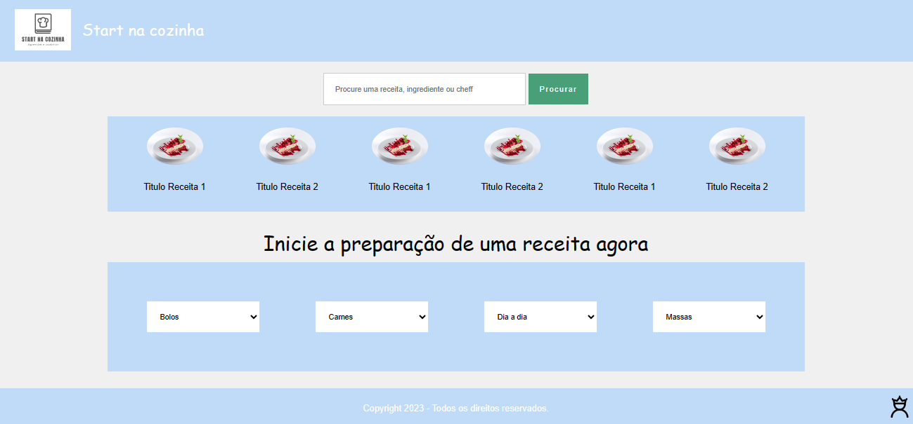

Figura 22 - Tela "Menu de Receitas"

O acesso à tela de cadastro poderá ser feito através do botão “Ver todas as receitas”, na "Home Page". As estruturas de dados foram baseadas em HTML, CSS e JS.

#### Requisito atendido

RF-01: A aplicação deve conter uma barra de pesquisa, onde o usuário poderá pesquisar receitas.

RF-02: A aplicação deve conter filtros onde o usuário poderá pesquisar a receita por ingredientes.

#### Artefatos da funcionalidade

● menuDeReceitas.html

● menuDeReceitasStyle.css

#### Estrutura de Dados

● N/A.

#### Instruções de acesso

1. Abra um navegador de Internet e informe a seguinte URL: https://github.com/ICEI-PUC-Minas-PMV-ADS/pmv-ads-2023-2-e1-proj-web-t2-projeto_start_na_cozinha_g4/blob/main/codigo-fonte/paginaHome/paginaHome.html;
2. Ao clicar em “Ver todas as receitas”, no quadro direito da tela, terá acesso à tela de Menu de receitas.

#### Responsável

Ana Beatriz

### RF-03 e RF-06 (Telas "Login do Chef", "Cadastro do Chef", "Cadastre uma nova receita" e "Atualização dos Dados do Chef") 

Exemplo da tela de Login do Chef:

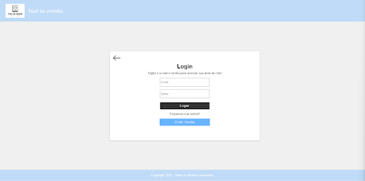

Figura 23 - Tela "Login do Chef"

O acesso à tela de login do chef poderá ser feito através da opção “Área do Chef”, contida na "Home Page" do site. As entradas de dados foram baseadas em HTML e CSS.

Exemplo da tela de Cadastro do Chef:

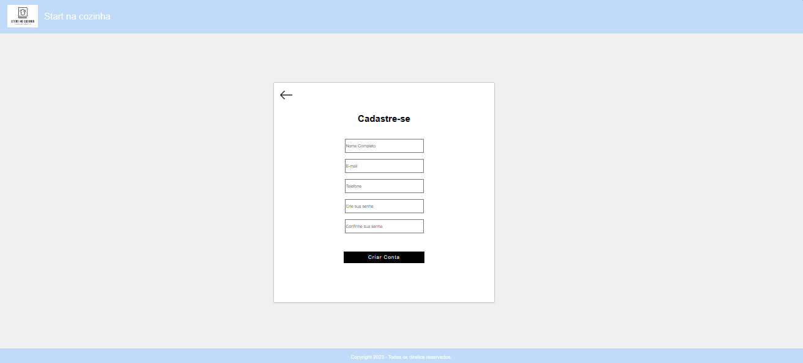

Figura 24 - Tela "Cadastro do Chef"

O acesso a tela de “Cadastro do Chef” poderá ser feito após o Chef acessar a “Home Page” e clicar na opção “Área do Chef” que o direcionará a tela “Login do Chef”, onde, por não possuir ainda uma conta, deverá clicar em “Criar conta”. Daqui será direcionado a esta tela de cadastro. Caso desista de se cadastrar, poderá clicar na seta localizada no canto superior esquerdo e retornar à “Home Page”. Ao final, será apresentado um modal de confirmação de cadastro. As estruturas de dados foram baseadas em HTML, CSS e JS.

Exemplo da tela de Cadastre uma Nova Receita:

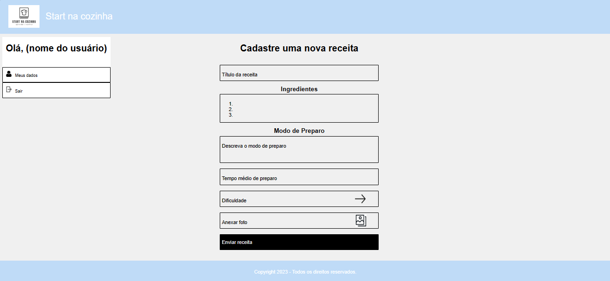

Figura 25 - Tela "Cadastre uma Nova Receita"

O acesso à tela de “Cadastre uma Nova Receita” ocorrerá após o Chef efetuar o login da conta dele na tela “Login do Chef”. Nela, o Chef poderá cadastrar uma nova receita informando o título da receita; os ingredientes; o modo de preparo; o tempo médio de preparo; o nível de dificuldade e poderá ainda anexar uma foto. Isto feito, as informações serão encaminhadas para a tela “Visualização/avaliação da receita”, onde permanecerá aguardando aprovação do moderador. Ao final, receberá um aviso de “Receita Enviada”

Alternativamente, no menu localizado no canto superior esquerdo da tela, poderá atualizar seus dados, ou sair desta tela. Optando pelo primeiro caminho, será direcionado a tela “Dados do Chef” de cadastro. Já escolhendo clicar em “Sair”, retorna à "Home Page". As estruturas de dados foram baseadas em HTML, CSS e JS.

Exemplo da tela de Atualização dos Dados do Chef:

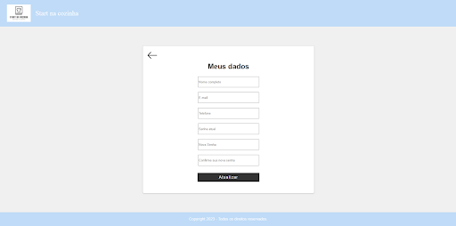

Figura 26 - Tela "Atualização dos Dados do Chef"

O acesso à tela de dados do chef poderá ser feito através da opção “Meus dados”, contida na tela em que o chef já está logado. As entradas de dados foram baseadas em HTML e CSS.

#### Requisito atendido

RF-03: A aplicação deve possibilitar a indicação do nível de dificuldade em cada receita;

RF-06: A aplicação deve ter um formulário para a inserção de novos chefs e novas receitas.

#### Artefatos da funcionalidade

Tela "Login do Chef":

● loginChef.html

● style.css

Tela "Cadastro do Chef":

● cadastrodochef.html

● cadastrodochef.css

Tela "Cadastre uma Nova Receita":

● cadastreumanovareceita.html

● cadastreumanovareceita.css

Tela "Atualização dos Dados do Chef":

● atualizaDadosChef.html

● style.css 

#### Estrutura de Dados

Tela "Login do Chef":

● N/A

Tela "Cadastro do Chef":

● N/A

Tela "Cadastre uma Nova Receita":

● N/A

Tela "Atualização dos Dados do Chef":

● N/A

#### Instruções de acesso

Tela "Login do Chef":
1. Abra um navegador de Internet e informe a seguinte URL: https://github.com/ICEI-PUC-Minas-PMV-ADS/pmv-ads-2023-2-e1-proj-web-t2-projeto_start_na_cozinha_g4/blob/main/codigo-fonte/paginaHome/paginaHome.html;
2. Na página inicial do site, clique em “Área do Chef” e será direcionado para a tela de login do chef.

Tela "Cadastro do Chef":
1. Abra um navegador de Internet e informe a seguinte URL: https://github.com/ICEI-PUC-Minas-PMV-ADS/pmv-ads-2023-2-e1-proj-web-t2-projeto_start_na_cozinha_g4/blob/main/codigo-fonte/paginaHome/paginaHome.html;
2. Ao clicar em “Área do Chef”, no quadro esquerdo da tela, terá acesso a página de login. Clique em "Criar conta” e terá acesso à página Cadastro do Chef.

Tela "Cadastre uma Nova Receita":
1. Abra um navegador de Internet e informe a seguinte URL: https://github.com/ICEI-PUC-Minas-PMV-ADS/pmv-ads-2023-2-e1-proj-web-t2-projeto_start_na_cozinha_g4/blob/main/codigo-fonte/paginaHome/paginaHome.html;
2. Ao clicar em “Área do Chef”, no quadro esquerdo da tela, terá acesso a tela de Login do Chef. Preencha o login e clique no botão “Logar”. Na sequencia será encaminhado para a tela “Cadastre uma Nova Receita”.

Tela "Atualização dos Dados do Chef":
1. Abra um navegador de Internet e informe a seguinte URL: https://github.com/ICEI-PUC-Minas-PMV-ADS/pmv-ads-2023-2-e1-proj-web-t2-projeto_start_na_cozinha_g4/blob/main/codigo-fonte/paginaHome/paginaHome.html;
2. Na página inicial do site, clique em “Área do Chef” e faça o login;
3. Já logado, clique na opção “Meus dados” no menu (canto superior esquerdo) e será direcionado para a página que possibilita atualizar os dados do chef.

#### Responsáveis

Caio Slavieiro - Telas "Cadastro do Chef" e "Cadastre uma Nova Receita";

Estevão Cota - Telas "Login do Chef" e "Atualização dos Dados do Chef".

### RF-04 (Tela "Visualização da Receita") 

Exemplo da tela de Visualização da Receita:

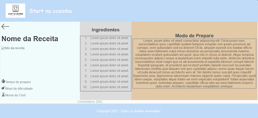

Figura 27 - Tela "Visualização da Receita"

O acesso à tela de cadastro poderá ser feito através dos links, na tela “Home Page”, referente à respectiva receita, ou através do link da respectiva receita na tela “Menu de Receitas”. As estruturas de dados foram baseadas em HTML, CSS e JS.

#### Requisito atendido

RF-04: A aplicação deve ter uma sessão de comentários para cada receita publicada.

#### Artefatos da funcionalidade

● pgvisureceita.html

● pgvisureceita.css

#### Estrutura de Dados

● [receitas.json](https://github.com/ICEI-PUC-Minas-PMV-ADS/pmv-ads-2023-2-e1-proj-web-t2-projeto_start_na_cozinha_g4/blob/main/codigo-fonte/pgvisureceita/receitas.json)

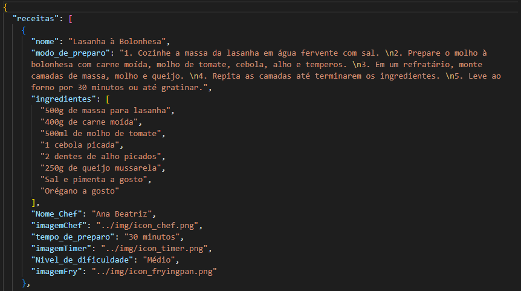

Figura 22 - Demonstração da Estrutura de Dados do arquivo json.

#### Instruções de acesso

1. Abra um navegador de Internet e informe a seguinte URL: https://github.com/ICEI-PUC-Minas-PMV-ADS/pmv-ads-2023-2-e1-proj-web-t2-projeto_start_na_cozinha_g4/blob/main/codigo-fonte/paginaHome/paginaHome.html;
2. Ao clicar em “Receita 1”, no quadro direito da tela, terá acesso à tela de Visualização da Receita.

#### Responsável

Clarence Silva

### RF-05 (Tela "Home Page") 

Exemplo da tela Home Page:

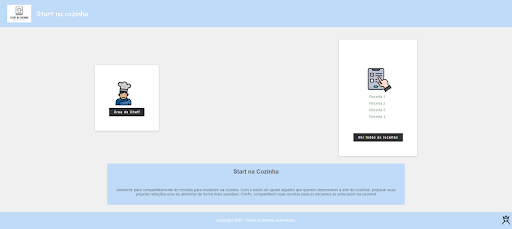

Figura 28 - Tela "Home Page"

O acesso à tela "Home Page" poderá ser feito através do primeiro acesso ao site. As estruturas de dados foram baseadas em HTML, CSS.

#### Requisito atendido

RF-05: A aplicação deve ter na tela principal dicas de receitas.

#### Artefatos da funcionalidade

● paginaHome.html

● style.css

#### Estrutura de Dados

● N/A 

#### Instruções de acesso

1. Abra um navegador de Internet e informe a seguinte URL: https://github.com/ICEI-PUC-Minas-PMV-ADS/pmv-ads-2023-2-e1-proj-web-t2-projeto_start_na_cozinha_g4/blob/main/codigo-fonte/paginaHome/paginaHome.html;
2. Ao entrar na tela principal, terá acesso à página "Home Page".

#### Responsáveis

Ana Beatriz

Clarence Silva

### RF-07 (Telas "Login do Moderador" e "Aprovação/Reprovação das Receitas") 

Exemplo da tela de Login do Moderador:

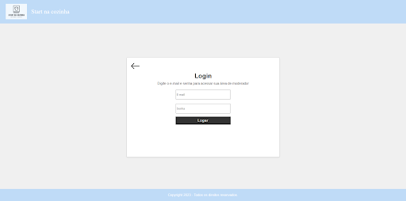

Figura 29 - Tela "Login do Moderador"

O acesso à tela de login do moderador poderá ser feito através do ícone que consta no canto inferior direito da tela inicial do site (home), no rodapé. As entradas de dados foram baseadas em HTML e CSS.

Exemplo da tela de Aprovação/Reprovação das Receitas:

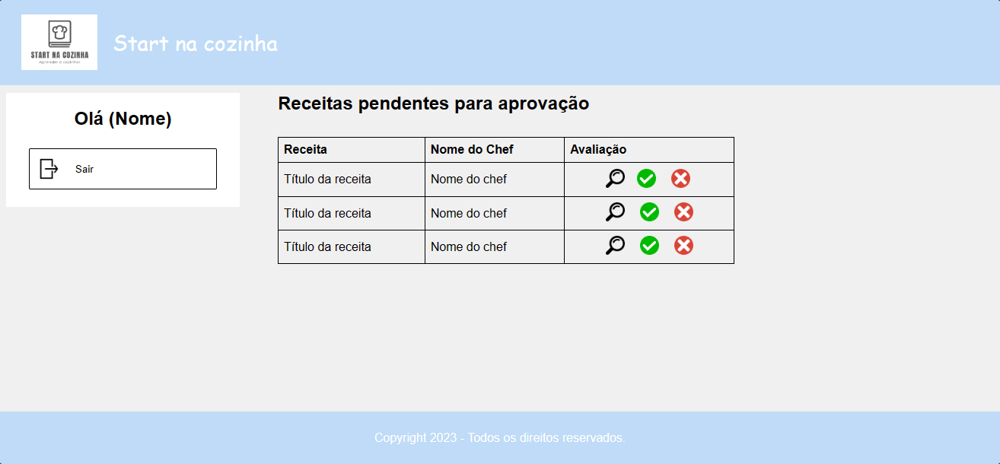

Figura 30 - Tela "Aprovação/Reprovação das Receitas

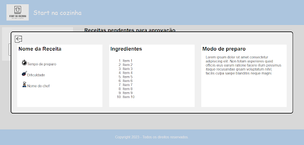

Figura 31 - Modal "Análise da receita a ser aprovada"

O acesso a tela será feito após o moderador entrar com seu login e senha, através da tela login do moderador, também o moderador poderá ver a receita pendente para aprovação através de um modal que abre após clicar no ícone de lupa. As entradas de dados foram baseadas em HTML, CSS e JS.

#### Requisito atendido

RF-07: A aplicação deve ter espaço que exibirá os formulários pendentes para aprovação.

#### Artefatos da funcionalidade

Tela "Login do Moderador":

● loginModerador.html

● style.css

Tela "Aprovação/Reprovação das Receitas":

● apr-rep-receitas.html

● apr-rep-receitas.css

● apr-rep-receitas.js

#### Estrutura de Dados

Tela "Login do Moderador":

● N/A 

Tela "Aprovação/Reprovação das Receitas":

● N/A

#### Instruções de acesso

Tela "Login do Moderador":
1. Abra um navegador de Internet e informe a seguinte URL: https://github.com/ICEI-PUC-Minas-PMV-ADS/pmv-ads-2023-2-e1-proj-web-t2-projeto_start_na_cozinha_g4/blob/main/codigo-fonte/paginaHome/paginaHome.html;
2. Na página inicial do site (Home Page), clique no ícone que consta no canto inferior (rodapé) direito e será direcionado para a tela de login do moderador.

Tela "Aprovação/Reprovação das Receitas":
1. Abra um navegador de Internet e informe a seguinte URL: https://github.com/ICEI-PUC-Minas-PMV-ADS/pmv-ads-2023-2-e1-proj-web-t2-projeto_start_na_cozinha_g4/blob/main/codigo-fonte/paginaHome/paginaHome.html;
2. Na página inicial do site (Home Page), clique no ícone que consta no canto inferior (rodapé) direito e será direcionado para a tela de login do moderador;
3. Ao colocar o login e senha de moderador, terá acesso a página de aprovação e reprovação de receitas;
4. Ao clicar no ícone de lupa poderá visualizar a receita para aprovação ou reprovação.

#### Responsáveis

Estevão Cota - Tela "Login do Moderador";

Gabriel de Oliveira - Tela "Aprovação/Reprovação das Receitas".

