# Registro de Testes de Software

Os resultados dos testes funcionais realizados na aplicação são descritos a seguir.

|Caso de Teste    | CT-1 - Verificação do funcionamento da barra de pesquisas |
|:---|:---|
| Resultados obtidos | A inclusão de palavras relacionadas a alguma receita cadastrada efetua o filtro da(s) respectiva(s) receita(s) e quando a palavra digitada não está relacionada a nenhuma receita registrada no sistema é apresentada uma mensagem "Nenhuma receita encontrada".  |
| Responsável pela execução do caso de Teste | Caio |

Figura 33 - Print da pesquisa de receita por palavra

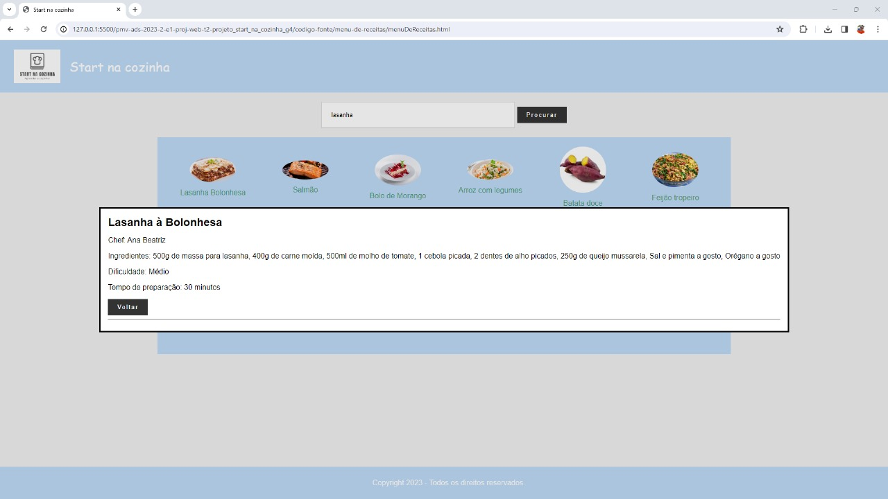

Figura 34 - Print do filtro com sucesso de receita por palavra

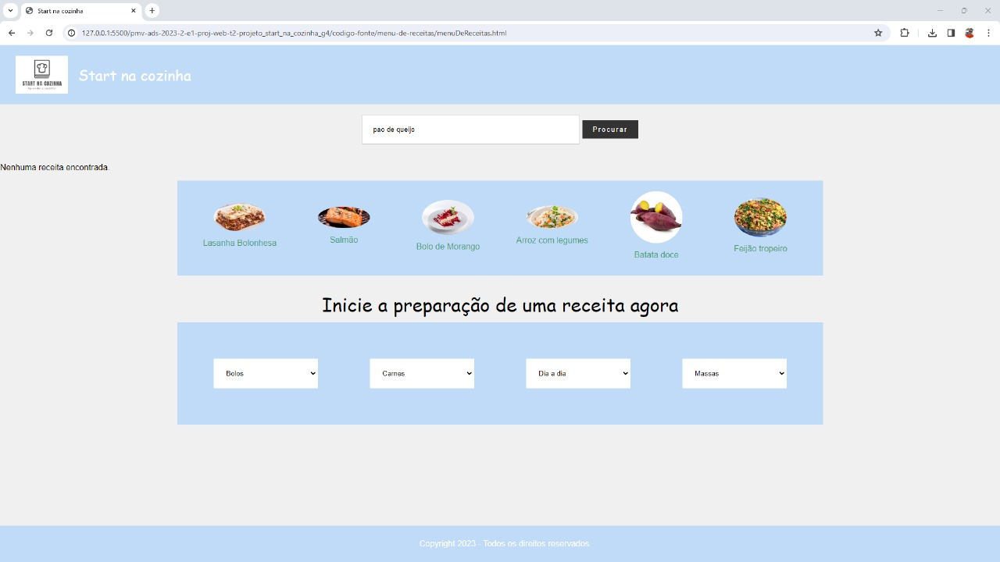

Figura 35 - Print do filtro sem sucesso de receita por palavra

---
---

|Caso de Teste    | CT-2 - Verificação do funcionamento dos seletores de ingredientes |
|:---|:---|
| Resultados obtidos | A seleção de ingredientes relacionados a alguma receita cadastrada efetua o filtro da(s) respectiva(s) receita(s).  |
| Responsável pela execução do caso de Teste | Estevão |

Figura 36 - Print da seleção de ingediente

Figura 37 - Print do filtro com sucesso de receita por seleção de ingediente

---
---

|Caso de Teste    | CT-3 - Verificação do funcionamento da indicação do nível de dificuldade da receita |
|:---|:---|
| Resultados obtidos | Ao efetuar o cadastro de uma receita é possível selecionar o nível de dificuldade no campo seletor.  |
| Responsável pela execução do caso de Teste | Gabriel |

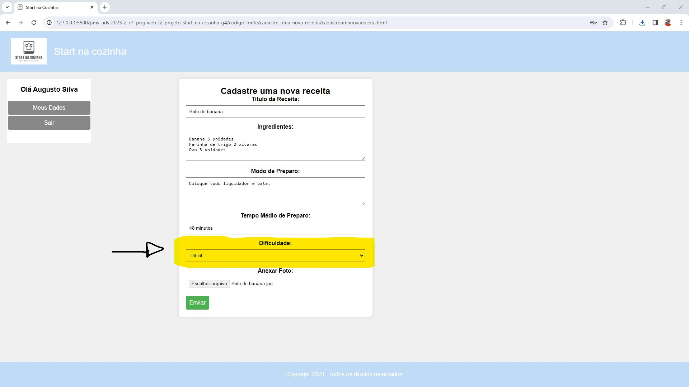

Figura 38 - Print da seleção do nível de dificuldade da receita ao efetuar o cadastro

---
---

|Caso de Teste    | CT-4 - Verificação do funcionamento da inclusão de comentários nas receitas |
|:---|:---|
| Resultados obtidos | Ao clicar no box "Comentários" na página de visualização da receita, é possível incluir um texto de comentário para registro na página.  |
| Responsável pela execução do caso de Teste | Ana Beatriz |

Figura 39 - Print da inclusão do comentário na apágina de visualização da receita

Figura 40 - Print da visualização do comentário incluído na página

---
---

|Caso de Teste    | CT-5 - Verificação dos links da tela principal para exibição de receitas |
|:---|:---|
| Resultados obtidos | Ao clicar nos links da página Home, é possível visualizar as respectivas receitas em sua página de exibição.  |
| Responsável pela execução do caso de Teste | Clarence |

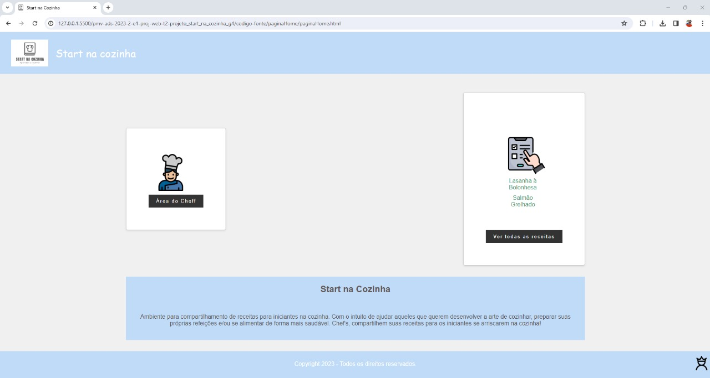

Figura 41 - Print do clique no link da tela principal

Figura 42 - Print do acesso às receitas pelos links da tela principal

---
---

|Caso de Teste    | CT-6 - Verificação do funcionamento dos formulários de cadastros dos Chef's e de novas receitas |
|:---|:---|
| Resultados obtidos | Ao preencher os formulários de cadastro dos Chef's e de novas receitas e clicar no botão de efetivação, os dados são salvos e há uma confirmação por mensagem no sistema.  |
| Responsável pela execução do caso de Teste | Caio |

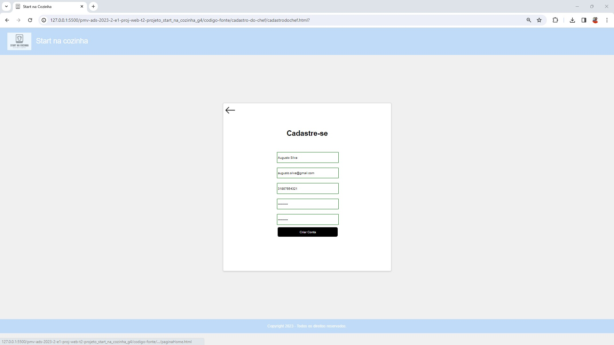

Figura 43 - Print da tela de preenchimento do formulário de cadastro do Chef

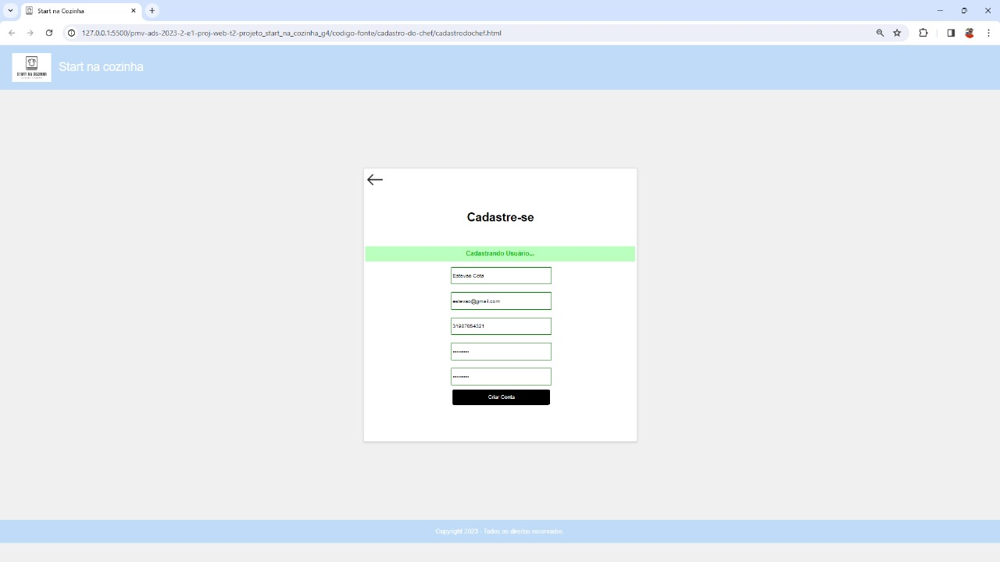

Figura 44 - Print da confirmação do cadastro do Chef

Figura 45 - Print do login do Chef

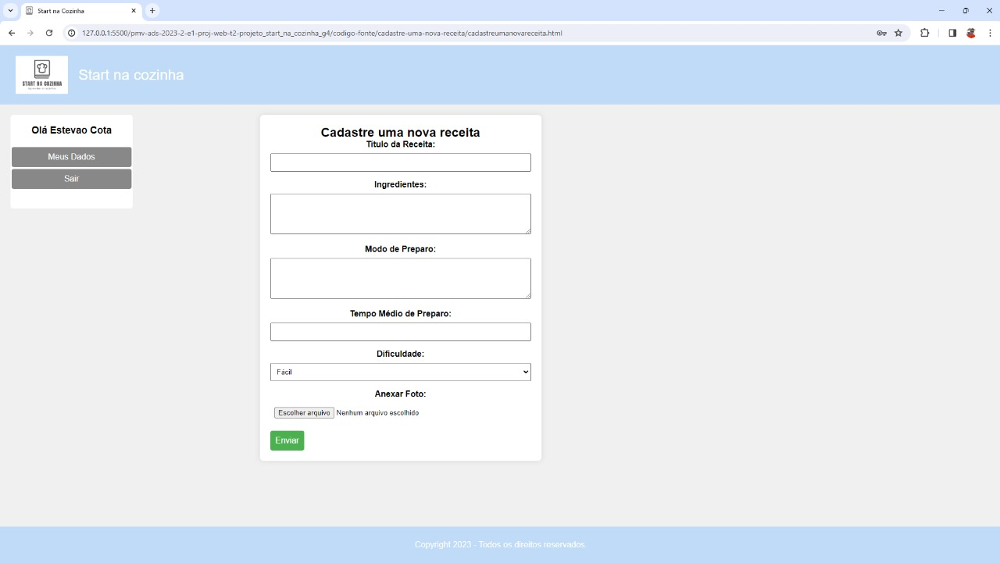

Figura 46 - Print do sucesso no login do Chef

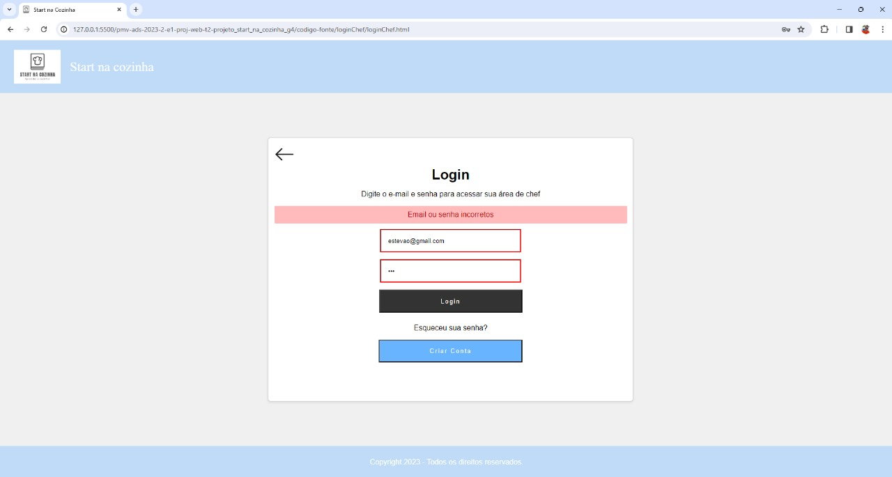

Figura 47 - Print do erro no login do Chef

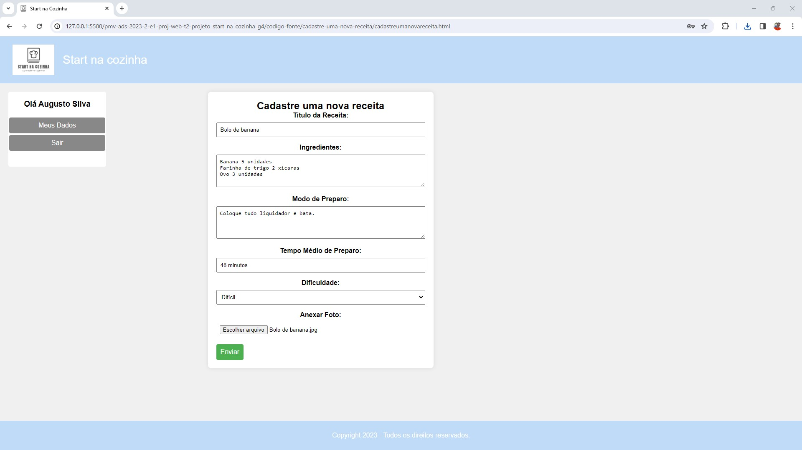

Figura 48 - Print da tela de preenchimento do formulário de cadastro das receitas

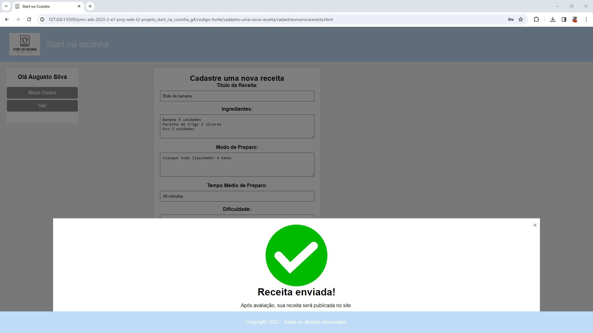

Figura 49 - Print da confirmação do cadastro da receita

---
---

|Caso de Teste    | CT-7 - Veificação da funcionalidade das aprovações/reprovações das receitas cadastradas |
|:---|:---|
| Resultados obtidos | Na área de avaliação das receitas é possível visualizar a receita cadastrada, aprová-la através do botão de aprovação ou reprová-la através do botão de reprovação.  |
| Responsável pela execução do caso de Teste | Estevão |

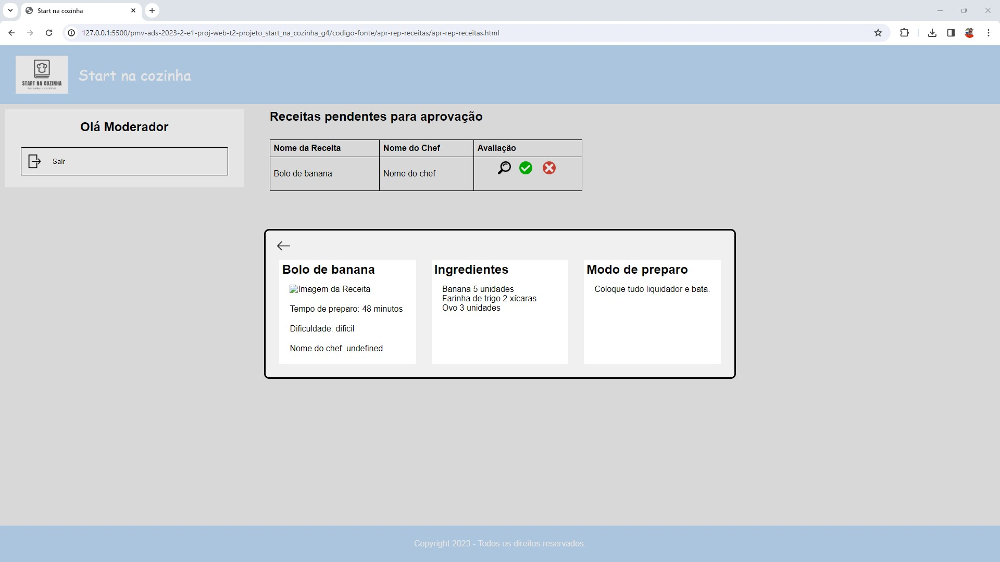

Figura 50 - Print da visualização da receita na área de aprovação/reprovação de receitas

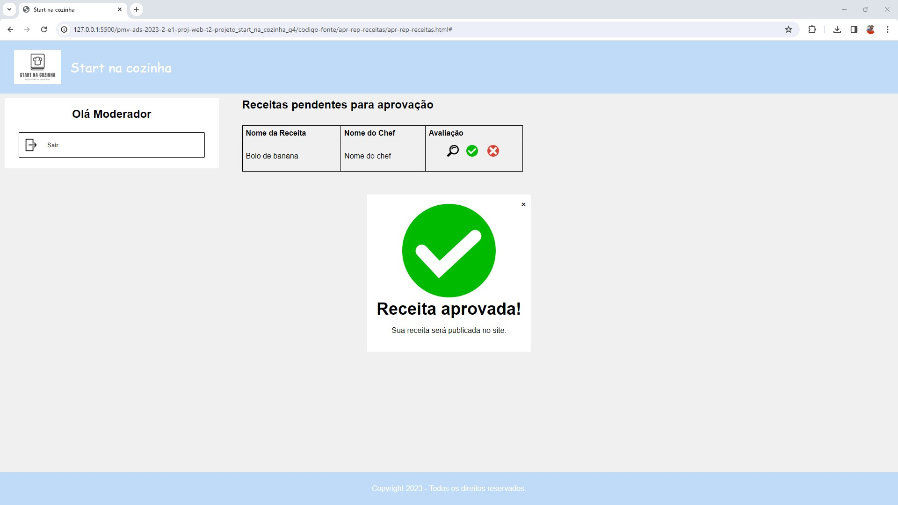

Figura 51 - Print da aprovação da receita cadastrada

Figura 52 - Print da reprovação da receita cadastrada

---
---